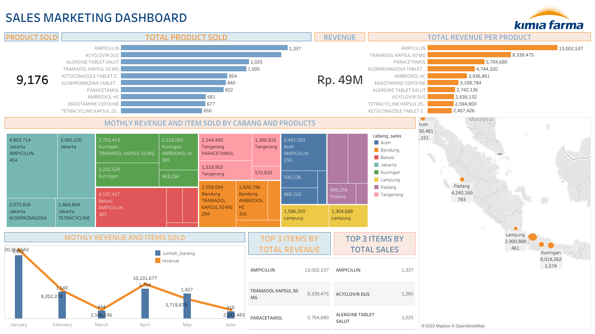

# VIX BIG DATA ANALYTIC KIMIA FARMA

## LATAR BELAKANG DAN OBJECTIVE
Stack holder meminta analyst untuk membuat visualisasi penjualan barang 

## RISET
1. Bagaimana penjualan obat dalam 6 bulan terakhir
2. Daerah mana saja yang penjulannya memiliki revenue tertinggi
3. Jenis Obat apa saja yang penjualannya memiliki revenue tertinggi

## DATA
Pada project kali ini data yang di gunakan ada 3 data yaitu terdiri dari :
1. Sheet Penjualan terdiri dari 12 column dan 350 row
2. Sheet Pelanggan terdiri dari 7 column dan 350 row
3. Sheet Barang terdiri dari 8 column dan 10 row

## Pengolahan Data
Pada proses ini terdapat beberapa data yang di aggregasi dan diubah formatnya
1. Membuat row revenue dengan mengalikan harga dan jumlah_barang
2. Merubah jumlah barang menjadi INT64
3. Merubah Harga menjadi FLOAT64
4. Meubah tanggal menjadi format date part
5. Joint table Penjualan, Pelanggan dan Barang menjadi Final_Table

### Visualisasi Data

