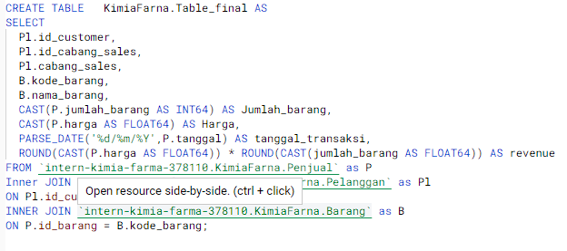

# VIX BIG DATA ANALYTIC KIMIA FARMA

- Stack holder meminta analyst untuk membuat visualisasi penjualan barang
- Data berasal dari Kimia Farma

## PROBLEM
1. Bagaimana penjualan obat dalam 6 bulan terakhir
2. Daerah mana saja yang penjulannya memiliki revenue tertinggi
3. Jenis Obat apa saja yang penjualannya memiliki revenue tertinggi

## DATA
Pada project kali ini data yang di gunakan ada 3 data yaitu terdiri dari :
1. Sheet Penjualan terdiri dari 12 column dan 350 row

2. Sheet Pelanggan terdiri dari 7 column dan 350 row

3. Sheet Barang terdiri dari 8 column dan 10 row

## Pengolahan Data
Pada proses ini terdapat beberapa data yang di aggregasi dan diubah formatnya
1. Membuat row revenue dengan mengalikan harga dan jumlah_barang
2. Merubah jumlah barang menjadi INT64
3. Merubah Harga menjadi FLOAT64
4. Meubah tanggal menjadi format date part
5. Joint table Penjualan, Pelanggan dan Barang menjadi Final_Table

Source : https://console.cloud.google.com/bigquery?sq=840030902480:d9c774cb557840df91507025993d45d8

### Visualisasi Data

Source : https://public.tableau.com/app/profile/ujeeg/viz/VIX_16774837666190/Dashboard2

1. Pada visualisasi dapat dilihat bahwa revenue selama 6 bulan terjadi penurunan
2. Obat yang paling banyak di beli oleh customer adalah Ampicilin dan Acylovir dus
3. Obat yang paling banyak menghasilkan revenue adalah Ampicilin dan Tramadol Kapsul 50 Mg
4. Revenue paling tinggi terdapat di Jakarta dan Kuningan
